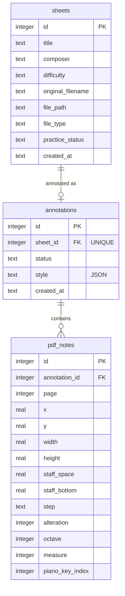

# PianoGo

https://github.com/user-attachments/assets/fe9d6a74-cdce-4b74-8dbc-5597a366b40c

PianoGo is a web app for beginner pianists. You upload sheet music (MusicXML or PDF), it labels every note (letter names or solfège), and you can practise measure by measure on an on-screen piano that shows which keys each hand plays.

It runs as a **single Next.js process** with **SQLite**. No extra services are needed.

## Features

**Sheet library**

- upload MusicXML or PDF files
- title, composer, difficulty and practice status
- search by title or composer, filter by difficulty and status, with thumbnail previews
- open, download or delete a sheet

**Music processing**

- parse MusicXML and label notes in the rendered score
- read notes from digital (vector) PDFs and draw labels over the original page
- recognise scanned PDFs with [Audiveris](https://audiveris.github.io) (optional install)
- customise labels: solfège or letter names, size, colour, case, position, octave numbers

**Piano**

- two keyboards, one per hand, linked to the score
- step through measures and play a whole measure with its notes numbered in order

**Settings**

- English or Spanish
- light, dark or system theme
- collapsible sidebar for a two-page score view

## How each document type is processed

When you click **Annotations**, PianoGo looks at the file type and takes one of three paths.

| | MusicXML | Digital PDF | Scanned PDF |
| --- | --- | --- | --- |
| Files | `.musicxml`, `.xml`, `.mxl` | PDF exported from notation software (MuseScore, Dorico, Finale, LilyPond…) | PDF of a photo or scan |
| Where notes are read | in the browser | on the server, during the request | on the server, in the background |
| How | OpenSheetMusicDisplay draws the score and a label is added to each note as it is drawn | pdf.js reads the page's drawing; staves, clefs, key signatures, accidentals and noteheads are found from the embedded music font | [Audiveris](https://audiveris.github.io) recognises the page image; PianoGo reads its output and works out pitches |
| What is stored | the `annotations` row only (status and style) | each note with its position on the page, in `pdf_notes` | same as digital PDF |
| Speed | instant | a few seconds | roughly 10–40 s per page |

A PDF is treated as a scan when no music font is found in it. Scans are read one at a time, the viewer shows which page Audiveris is on, and labels appear when it finishes. If Audiveris is not installed, scanned PDFs can still be viewed but not annotated.

## Architecture

One Next.js app serves both the UI and the API. The backend is split into two domains that share one SQLite file and meet only on `sheet_id`.

```
browser
   │
   ▼
Next.js (UI + /api/*)
   ├── lib/library     → sheets, uploaded files, previews
   └── lib/processing  → annotations, pdf_notes, PDF/OMR parsing
           │
           ▼
     SQLite ($DATA_DIR/pianogo.db)
```

| Path | Contents |
| --- | --- |
| `app/` | page and API route handlers (`/api/sheets`, `/api/annotations`) |
| `components/` | React UI: library, piano, processing (score views), settings, `ui/` (shadcn) |
| `lib/db.ts` | opens SQLite, creates the schema and runs migrations |
| `lib/library/` | sheet model, validation, queries, previews |
| `lib/processing/` | annotations, solfège, PDF note extraction (`pdf/`), Audiveris OMR (`omr/`) |
| `lib/settings/` | translations and user preferences |
| `tests/` | Jest unit tests for `lib/` |

### Database

Three tables. `sheets` belongs to the library; `annotations` and `pdf_notes` belong to processing. The only link between the domains is `annotations.sheet_id`, and each sheet has at most one annotation (see ADR-3 in [ADR.md](ADR.md)).



`pdf_notes` holds the notes read from PDFs (vector or scanned), with their position on the page so labels can be drawn over the original file. MusicXML notes are not stored: OpenSheetMusicDisplay renders the score in the browser and the labels are added as it is drawn, so for MusicXML only the `annotations` row (status and style) is saved. Uploaded files live under `$DATA_DIR/uploads/` and PDF thumbnails under `$DATA_DIR/previews/`.

Design decisions are recorded in [ADR.md](ADR.md).

## Setup

Requires Node.js 22+.

```bash
npm install
npm run build
npm start
```

Then open http://localhost:3000. For development, use `npm run dev`.

The database and upload folder are created on first run.

### Audiveris (optional, for scanned PDFs)

Everything except scanned PDFs works without it.

1. Download the installer for your OS from the [Audiveris releases page](https://github.com/Audiveris/audiveris/releases). It includes its own Java runtime.
2. Install it to the default location. PianoGo looks for it here:

   | OS | Path |
   | --- | --- |
   | Windows | `C:\Program Files\Audiveris\Audiveris.exe` |
   | macOS | `/Applications/Audiveris.app/Contents/MacOS/Audiveris` |
   | Linux | `/opt/audiveris/bin/Audiveris` or `/usr/bin/audiveris` |

3. If you installed it somewhere else, set `AUDIVERIS_PATH` to the launcher.
4. Open a scanned PDF and click **Annotations**.

### Environment

| Variable | Default | Meaning |
| --- | --- | --- |
| `PORT` | `3000` | listen port |
| `DATA_DIR` | `./data` | SQLite database and uploaded files |
| `AUDIVERIS_PATH` | standard install location | Audiveris launcher, needed only for scanned PDFs |

`npm start` binds to `0.0.0.0`.

```bash
PORT=8080 DATA_DIR=/tmp/pianogo npm start
```

## Tests

```bash
npm test -- --coverage
```

Tests cover the core logic in `lib/` (not routes or React). Each test file uses its own temporary `DATA_DIR`. The coverage threshold is 70%.

Coverage is measured over `lib/db.ts`, `lib/library/` and `lib/processing/`. Latest result (2026-10-04, 14 suites, 113 tests):

| Statements | Branches | Functions | Lines |
| --- | --- | --- | --- |
| 96.14% | 91.86% | 98.31% | 97.85% |

`npm test -- --coverage` fails if any of these drops below 70%. The thinnest file is `lib/library/preview.ts` (58%), since rendering a PDF page needs pdf.js and a real canvas. pdf.js and Audiveris are faked in their tests, so these tests do not need Audiveris installed.
