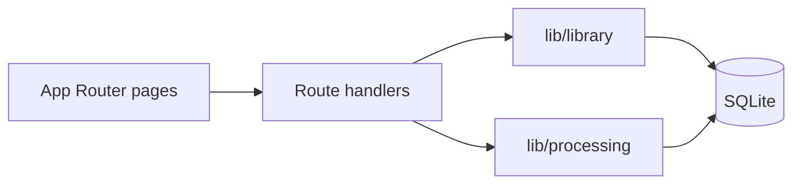
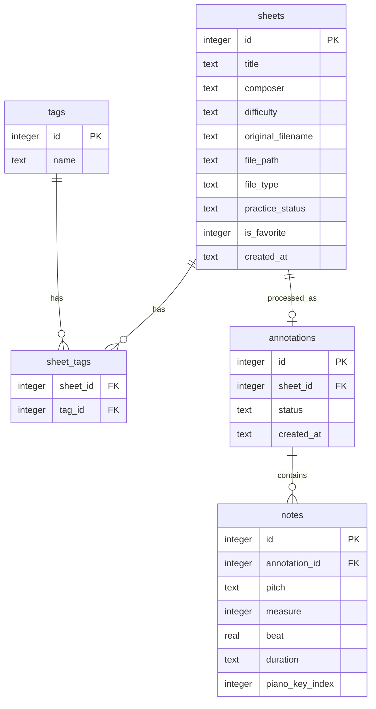

# PianoGo

PianoGo is a web app for beginner pianists. You upload sheet music (MusicXML or PDF), it names the notes (C4, D4, …), and you can click a note to see the matching keys on a top-down piano.

This repo is a **single Next.js process** with **SQLite**. No extra services, no Docker, no cloud DB. That is on purpose: Assignment 2 will containerize this same app.

## Idea

Beginners can hear a piece and still get lost on the page. PianoGo keeps a personal library of sheets and adds a second, separate step: extract notes, store annotations, and map them to piano keys. Those two jobs stay loosely coupled so they can become two services later.

**Who it is for:** beginner pianists practising at home.  
**Scale we are designing for:** a class or small studio (~100 daily users), not a public SaaS. One Node process and one SQLite file is enough.

## Features

Two backend domains. Both read and write SQLite. Neither is “just a UI.”

### Domain 1 — Sheet library

Owns uploads, metadata, and how you find pieces again.

- upload and store MusicXML / PDF
- title, composer, difficulty, tags, favourites, practice status
- search and filter the library
- open a sheet and download / print the annotated version

### Domain 2 — Music processing

Owns notes, annotations, and piano mapping. It only needs a sheet id from the library; it does not manage files or tags.

- parse MusicXML (and a simple PDF path in v1)
- store note names and positions
- map a selected note to keys on a static piano diagram

**Not in v1:** OCR from photos, animated playback, transposition, interactive drills. Those were left out on purpose (see `ADR.md` when it exists).

## How it will work

One Next.js app serves the pages and the API. Browser never talks to a second backend.

1. User uploads a file. Library writes the file under `DATA_DIR` and a row in `sheets`.
2. User (or the upload handler) asks processing to annotate that sheet id.
3. Processing parses the file, writes `annotations` + `notes`, and can answer “which piano keys for this note?”
4. The sheet page shows the score, the named notes, and a piano that highlights from stored notes — not from live parsing on every click.

```
browser
   │
   ▼
Next.js (one process: UI + /api/*)
   │
   ├── lib/library     → sheets, tags, files
   └── lib/processing  → annotations, notes, key map
           │
           ▼
     SQLite  (DATA_DIR/pianogo.db)
```

The seam for a later split: library keeps HTTP + file storage; processing becomes a service that receives a sheet id + file path and returns annotation ids.

## Software architecture

Monolith, two modules, one database file.

| Layer | What lives there |
| --- | --- |
| `app/` | pages and route handlers only. No business rules. |
| `lib/library/` | library domain: validate metadata, store files, query/filter. |
| `lib/processing/` | processing domain: parse, annotate, map pitch → piano key. |
| `lib/db.ts` | open SQLite, run migrations if the file is new. |
| `tests/` | unit tests on `lib/*` only — not Next routing. |

**Why Next.js:** one process can serve UI and API (`npm start`). I already know React. Templates-only (Flask/Jinja) would mean a weaker piano UI; a separate frontend repo would break the single-process rule.

**Why SQLite:** required, and it fits one container. Path is documented below so a deploy script can mount a volume.

**Why not extra packages for queues/Redis:** that would be a second process. Cross-domain work is in-process function calls.



### Database (must match ADR-3 later)

Library tables do not store note lists. Processing tables do not store title/composer/tags. They meet only on `sheet_id`.



## Codebase structure

Target: one `package.json` at the repo root, roughly 15–50 source files, ~12 third-party packages.

```
PianoGo/
├── README.md
├── ADR.md                 # 5 architecture decisions (assignment)
├── AI_USAGE.md
├── package.json           # only dependency manifest
├── package-lock.json
├── jest.config.js
├── app/                   # next.js ui + api
│   ├── page.tsx           # library home
│   ├── sheets/[id]/       # view + piano
│   └── api/
│       ├── sheets/        # library http
│       └── annotations/   # processing http
├── lib/
│   ├── db.ts              # sqlite open + schema
│   ├── library/           # domain 1
│   └── processing/        # domain 2
├── data/                  # default sqlite + uploads (gitignored)
└── tests/
    ├── library/
    └── processing/
```

Do **not** add: `Dockerfile`, `docker-compose.yml`, `.github/workflows/`, Terraform, a second `package.json`, or Redis/Celery.

## Setup

Needs Node.js 22+. No `.env` file required.

```bash
git clone <this-repo>
cd PianoGo
npm install
npm run build
npm start
```

Then open `http://localhost:3000`.

`npm start` must:

- start **one** process
- bind **`0.0.0.0`** (not `127.0.0.1`)
- read **`PORT`** (default `3000`)
- create SQLite + folders on first run (no wizard, no `input()`)

### Environment

| Variable | Default | Meaning |
| --- | --- | --- |
| `PORT` | `3000` | listen port |
| `DATA_DIR` | `./data` | sqlite + uploaded files |
| `HOST` | `0.0.0.0` | bind address |

SQLite file (one path, always):

```
$DATA_DIR/pianogo.db
```

Example:

```bash
PORT=8080 DATA_DIR=/tmp/pianogo npm start
```

Reconfigure only with env vars. Do not edit source to change port or db path.

### Tests and coverage

Tests cover **library and processing logic in `lib/`**, not Next.js routing.

```bash
npm test -- --coverage
```

Threshold: **≥70%** on that core logic (Jest).  
Coverage result: _fill in after the first real run, e.g. `Stmts 78%`. Target ≥70%._

## Assignment constraints (checklist)

- [x] One process, one container later; two **logical** domains now
- [x] SQLite at `$DATA_DIR/pianogo.db`
- [x] One manifest: root `package.json`
- [x] No Docker / CI / IaC authored here
- [x] Configurable via env only; ready in a few seconds
- [ ] `ADR.md` — 5 entries, 3+ commit dates
- [ ] `AI_USAGE.md` — one row per real AI session
- [ ] 12+ meaningful commits, 6+ days, push to GitHub
