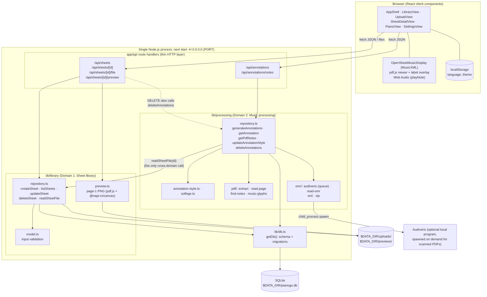
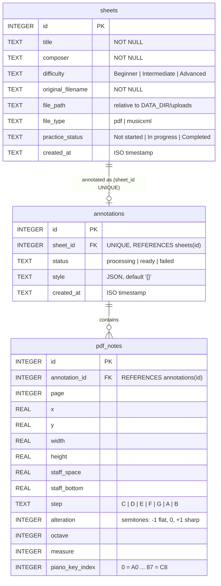

# PianoGo: Project Report

**Individual Assignment 1: Build a Simple Application to Serve as the Basis for DevOps Work**
Repository: https://github.com/iciaradelino/PianoGo · Date: 2026-10-04

## 1. Introduction

PianoGo is a web app for beginner pianists who cannot yet read sheet music fluently. A user uploads a score (MusicXML, or a PDF that is either exported from notation software or scanned), PianoGo labels every note with its name (solfège or letter names), and the user can then practise measure by measure on an on-screen piano that shows which keys each hand plays and in which order.

**Stakeholders (invented to drive design choices).** The primary user is a self-taught adult beginner practising at home. The secondary stakeholder is a small music studio: one teacher with about 30 students, who wants students to arrive at lessons having already worked out the notes. I sized the app for that studio: about 100 daily users, libraries of tens to a few hundred sheets, and occasional scanned PDFs. That is why SQLite and a single process are more than enough, why there is no login yet (ADR-5), and why slow scan recognition runs as one background job at a time instead of on a separate worker service.

The app runs as **one Next.js process** with **one SQLite file**. It has two backend feature domains, **Sheet library** and **Music processing**, that share the database but meet only on a sheet id.

## 2. SDLC Model and Justification

### 2.1 Model chosen: iterative and incremental, with feature branches

I used an **iterative, incremental model**: a short planning phase, then a sequence of small increments, each one a vertical slice (UI, API, domain logic, storage) that left the app runnable at the end. Larger increments were built on their own Git branch (uploads, piano, PDF annotations, scanned annotations, settings) and merged into `main` when they worked.

- **Waterfall** was rejected because the hardest parts (reading notes from PDFs, recognising scans) were research problems. I could not know in advance whether PDF parsing would be reliable enough to design it all up front.
- **Scrum** proper (sprints, backlog grooming, retrospectives) assumes a team. As a single developer with a two-week deadline, the ceremonies would have been overhead.
- **Iterative/incremental** fitted because each increment answered a question ("can I persist uploads?", "can I find noteheads in a PDF?") and produced something usable even if later increments failed.

### 2.2 SMART goals

| # | Goal (Specific, Measurable, Achievable, Relevant, Time-bound) | Outcome |
| --- | --- | --- |
| G1 | By **2026-10-01**, a user can upload a PDF or MusicXML file with title, composer and difficulty, and it is still in the library after a server restart. | Met on 2026-10-01 (merged through PR #1). |
| G2 | By **2026-10-03**, the "Annotations" button labels **every note** of a MusicXML score and of a PDF exported from MuseScore, with the label style saved per sheet. | Met on 2026-10-03. Scanned PDFs were added the same day as a stretch goal. |
| G3 | By **2026-10-04**, the Piano tab plays any annotated measure with both hands shown on two keyboards, keys numbered in playing order. | Met on 2026-10-04. |
| G4 | By **2026-10-04**, automated unit tests on the domain logic reach **≥ 70 %** statement coverage, with a threshold that fails the run below 70 %. | Met: 113 tests, **96 % statements / 92 % branches**. |
| G5 | Throughout, the app satisfies the §7 container contract (one start command, `0.0.0.0`, `PORT`/`DATA_DIR` from env, no manual setup, ready in seconds). | Met (see 3.4). |
| G6 | Process: **≥ 12 commits on ≥ 6 distinct days**, no day above 40 %, and 5 ADR entries written as decisions are made. | Commits met: over 40 commits on 9 days, busiest day about 30 %. ADRs partly met (see 2.3). |

### 2.3 How I did and did not follow the model in practice

**Followed.** Increments were real vertical slices: app shell → library UI → uploads and persistence → piano → annotations for MusicXML, PDFs and scans → two-hand practice and tests, each leaving the app runnable. Feedback also changed the plan: the first iteration was a Python skeleton, but once I planned the piano and score views it was clear most of the code would be JavaScript, so I restarted on Next.js after one day instead of rewriting at the end (ADR-1). Scope was cut inside increments (no login, ADR-5) rather than by delaying the release.

**Deviated.** Most tests were written in one increment at the end instead of with each feature; they found two real bugs, including scans with no clef being read a sixth too low, that earlier tests would have caught. Work was concentrated on the last few days (about two-thirds of commits on 10-01, 10-03 and 10-04), and a few late commits bundle several changes or have vague messages. The ADR entries carry the dates the decisions were made, but the file was only committed with content on 10-04, so the history does not show it growing. Only the first feature branch went through a pull request.

**Lesson for Assignment 2.** Keep the incremental model but add a "definition of done" per increment (tests written, ADR committed, PR opened), so testing and the decision log keep pace with the code.

## 3. Architecture Overview

PianoGo is a single Next.js (App Router, TypeScript) process. The same process serves the React UI and the JSON API. Backend logic is split by domain, and both domains use one SQLite connection.



### 3.1 The two domains and the seam between them

| | Sheet library | Music processing |
| --- | --- | --- |
| Responsibility | Store uploaded files and metadata; list, search, edit and delete sheets; render thumbnails. | Turn a sheet's file into positioned, named notes and piano keys; store the label style; track annotation status. |
| Owns tables | `sheets` | `annotations`, `pdf_notes` |
| API | `/api/sheets/*` | `/api/annotations/*` |

The dependency only goes one way: processing asks the library for a sheet's file through a single function, and the library never imports processing. The one action that needs both, deleting a sheet, is coordinated in the route handler rather than inside either domain (ADR-2). To split them into services later, that one function becomes an HTTP call to the library (the endpoint already exists), processing gets its own database, and `annotations.sheet_id` becomes a plain id.

### 3.2 How an annotation request flows

1. The user clicks **Annotations** on a sheet, and the browser asks the processing API to annotate it.
2. Processing fetches the file from the library and decides how to read it based on its type (see 3.3).
3. MusicXML and digital PDFs finish within the request. Scanned PDFs are queued as a background job, and the browser polls until the annotation is ready or has failed.
4. The viewer loads the stored notes and draws the labels over the original score.

The scan job is an in-process queue that starts a local program on demand, not a separate service, so it stays inside the single-process contract. Audiveris is optional: everything except scanned PDFs works without it.

### 3.3 The three document types

| | MusicXML | Digital (vector) PDF | Scanned PDF |
| --- | --- | --- | --- |
| Where pitches come from | the file itself | the page's drawing instructions (music-font glyphs and staff lines) | Audiveris's recognition of the page image |
| Where the work runs | browser | server, during the request | server, background job |
| Stored in SQLite | annotation only | annotation + notes | annotation + notes |

**MusicXML** already contains every pitch, so the browser draws the score and adds labels as it goes; storing the notes would only duplicate the file. **Digital PDFs** contain no notes, only drawn lines and glyphs, so the server finds the staves, clefs, key signatures and noteheads and works out each pitch from its height on the staff. **Scans** are just images, so they go through optical music recognition with Audiveris, and its output is turned into pitches with the same staff logic. Both PDF paths store notes with their page position in the same table, so the viewer draws them the same way.

### 3.4 Deployment contract (§7)

| Requirement | How PianoGo meets it |
| --- | --- |
| One start command | `npm start` (after `npm install` and `npm run build`) |
| Bind `0.0.0.0` | `next start -H 0.0.0.0` |
| Port from env | `PORT`, default `3000` |
| No interactive setup | the data folder, tables and migrations are created on first use |
| SQLite at a documented path | `$DATA_DIR/pianogo.db`, `DATA_DIR` defaults to `./data` |
| One manifest | `package.json` + `package-lock.json` at the root (12 runtime dependencies) |
| Config by env only | `PORT`, `DATA_DIR`, `AUDIVERIS_PATH`; no `.env` file required |

## 4. Database Model

There are three tables. `sheets` belongs to the library; `annotations` and `pdf_notes` belong to processing. The only relationship that crosses the domain boundary is `annotations.sheet_id → sheets.id`, which is `UNIQUE`, so a sheet has zero or one annotation (ADR-3). This diagram matches the actual schema.



**Key schema decisions (ADR-3).**

- **Each domain's tables hold only its own data**, so a later split only has to turn one foreign key into a plain id.
- **Notes hang off the annotation, not the sheet**, so re-annotating replaces one annotation and its notes in a single transaction without touching the library's table.
- **The label style is stored as JSON** rather than one column per option, because the options were still changing; it is validated in code since SQLite cannot check it.
- **MusicXML notes are not stored**, because the browser already reads them from the file.
- **`CHECK` constraints and foreign keys** reject invalid values even if code validation is bypassed, and schema changes are applied automatically at startup, so there is no manual migration step.

## 5. Testing Summary

Unit tests (Jest) call the domain logic of both domains directly, not routes or React components. Database tests run against a real SQLite file in a temporary data folder; only outside programs (pdf.js and Audiveris) are faked. A 70 % threshold fails the run if coverage drops (ADR-4).

```bash
npm test -- --coverage
```

| Statements | Branches | Functions | Lines |
| --- | --- | --- | --- |
| 96.14 % | 91.86 % | 98.31 % | 97.85 % |

The thinnest area is thumbnail rendering, which needs a real PDF renderer and canvas.

## 6. Setup

Requires Node.js 22+.

```bash
npm install
npm run build
npm start
```

The app opens on http://localhost:3000 and creates `data/pianogo.db` on first run. `PORT`, `DATA_DIR` and the optional `AUDIVERIS_PATH` (only needed for scanned PDFs) can be set as environment variables, for example `PORT=8080 DATA_DIR=/tmp/pianogo npm start`.

## 7. AI Disclosure Statement

I acknowledge the use of **Cursor** (2026-09-25 to 2026-10-01) and **Claude Code** (2026-10-03 to 2026-10-04) to scaffold the project, generate, modify and debug code, write unit tests and draft documentation. The prompts used include "Set up a Nextjs skeleton…", "Save uploads in SQLite and on disk…", "Build the Piano tab…", "Annotate scanned PDFs with Audiveris" and "Write unit tests for the core logic of both domains with at least 70% coverage". The output of these prompts was used to build the UI, API routes, domain logic and test suite. I reviewed every change, rejected the Python skeleton in favour of Next.js, corrected generated code where it was wrong, and made the architectural decisions recorded in `ADR.md`. The detailed per-interaction log is in `AI_USAGE.md`.
