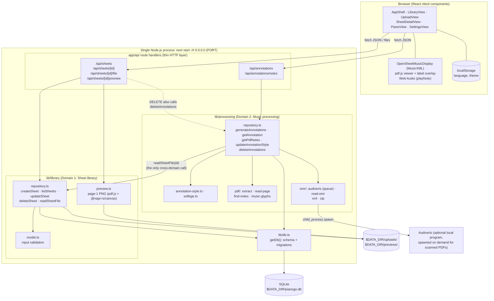
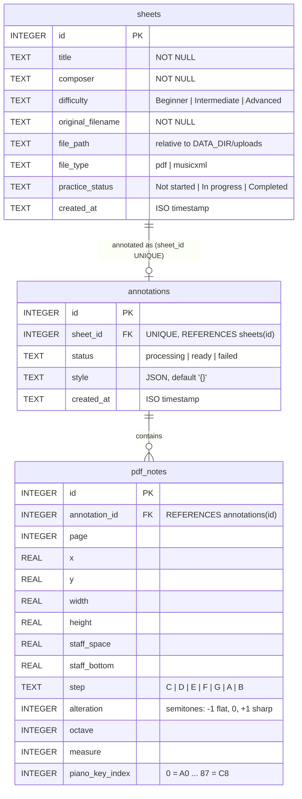

# PianoGo: Project Report

**Individual Assignment 1: Build a Simple Application to Serve as the Basis for DevOps Work**
Repository: https://github.com/iciaradelino/PianoGo · Date: 2026-10-04

## 1. Introduction

PianoGo is a web app for beginner pianists who cannot yet read sheet music fluently. A user uploads a score (MusicXML, or a PDF that is either exported from notation software or scanned), PianoGo labels every note with its name (solfège or letter names), and the user can then practise measure by measure on an on-screen piano that shows which keys each hand plays and in which order.

**Stakeholders (invented to drive design choices).** The primary user is a self-taught adult beginner practising at home. The secondary stakeholder is a small music studio: one teacher with about 30 students, who wants students to arrive at lessons having already worked out the notes. I sized the app for that studio: about 100 daily users, libraries of tens to a few hundred sheets, and occasional scanned PDFs. That size is why SQLite and a single process are more than enough, why there is no login yet (ADR-5), and why slow optical music recognition runs as one background job at a time instead of on a separate worker service.

The app runs as **one Next.js process** (`npm start`) with **one SQLite file** at `$DATA_DIR/pianogo.db`. It has two backend feature domains, **Sheet library** and **Music processing**, that share the database but meet only on a sheet id.

## 2. SDLC Model and Justification

### 2.1 Model chosen: iterative and incremental, with feature branches

I used an **iterative, incremental model**: a short planning phase, then a sequence of small increments, each one a vertical slice (UI, API route, domain logic, storage) that left the app runnable at the end. Each larger increment was built on its own Git branch (`feature/uploads`, `feature/piano`, `feature/pdf-annotations`, `feature/scanned-annotations`, `feature/settings`, …) and merged into `main` when it worked.

**Why this model and not the alternatives:**

- **Waterfall** was rejected because the hardest parts (reading notes from PDFs, recognising scans) were research problems. I could not know in advance whether vector PDF parsing would be reliable enough, so I could not write a full design up front and then build it.
- **Scrum** proper (sprints, backlog grooming, reviews, retrospectives) assumes a team. As a single developer with a two-week deadline, the ceremonies would have been overhead with nobody to hold them with.
- **Iterative/incremental** fitted because each increment answered a question ("can I persist uploads?", "can I find noteheads in a PDF?") and produced something usable even if later increments failed. If PDF annotation had not worked, the MusicXML path and the library would still have been a complete product.

### 2.2 SMART goals

| # | Goal (Specific, Measurable, Achievable, Relevant, Time-bound) | Outcome |
| --- | --- | --- |
| G1 | By **2026-10-01**, a user can upload a PDF or MusicXML file with title, composer and difficulty, and it is still in the library after a server restart (stored in SQLite + `$DATA_DIR/uploads`). | Met on 2026-10-01 (`35de2b8`, merged through PR #1 `feature/uploads`). |
| G2 | By **2026-10-03**, the "Annotations" button labels **every note** of a MusicXML score and of a vector PDF exported from MuseScore, with the label style saved per sheet. | Met on 2026-10-03 (`9f19454`, `90b6a0a`, `383e2ef`). Scanned PDFs via Audiveris were added the same day as a stretch goal (`2925e36`). |
| G3 | By **2026-10-04**, the Piano tab plays any annotated measure with both hands shown on two keyboards, keys numbered in playing order. | Met on 2026-10-04 (`10f24b4`). |
| G4 | By **2026-10-04**, automated unit tests on `lib/` reach **≥ 70 %** statement coverage, measured with `jest --coverage`, with a threshold that fails the run below 70 %. | Met: 14 suites, 113 tests, **96.1 % statements / 91.9 % branches** (`8ff6ca9`). |
| G5 | Throughout, the app satisfies the §7 container contract: started by `npm start`, binds `0.0.0.0`, reads `PORT` and `DATA_DIR`, creates its schema on first start with no manual step, and is ready in a few seconds. | Met: `next start -H 0.0.0.0`; `lib/db.ts` creates and migrates the schema on first `getDb()`. |
| G6 | Process: **≥ 12 commits on ≥ 6 distinct days**, no day above 40 %, and 5 ADR entries written as decisions are made. | Commits met: 37 commits on `main` over 9 days, busiest day 9/37 = 24 %. ADRs partly met (see 2.3). |

### 2.3 How I did and did not follow the model in practice

**Where I followed it.**

- *Increments were real vertical slices.* The sequence on `main` reads as increments: app shell (09-28) → library UI with mock data (09-29) → upload screen (09-30) → persistence, previews and piano (10-01) → MusicXML annotations, editable styles, vector PDFs, scans, settings (10-03) → two-hand piano practice, tests (10-04). Each left the app runnable.
- *Feedback changed the plan.* The first iteration (09-25) was a Python skeleton (`app.py`, `pianogo/library`, `pianogo/music_processing`). When I planned the piano and score views, it was clear that almost all the interesting code would be JavaScript (OpenSheetMusicDisplay, pdf.js, Web Audio), so on 09-28 I threw the skeleton away and restarted on Next.js (ADR-1). That pivot is what an iterative model is meant to allow: it cost one day instead of a rewrite at the end.
- *Feature branches isolated risky work.* `feature/uploads` was merged through a GitHub pull request (PR #1), and `feature/piano` was merged after resolving conflicts with `main` (I kept main's SQLite uploads and previews and the branch's piano view).
- *Scope was cut inside increments, not by delaying the whole release.* Login was explicitly left out (ADR-5), and MusicXML notes are not stored server-side because the browser already names them as it draws the score (ADR-3).

**Where I deviated.**

- *Testing was not done per increment.* The model calls for each increment to be tested before moving on, but I wrote almost all unit tests in one increment at the end (10-04). They found two real bugs that had been in `main` for a day: `read-omr.ts` reused the vector-PDF `TREBLE` reference, which counts from the bottom staff line rather than Audiveris's middle line, so scans with no clef read a sixth too low; and `audiveris.ts` did not clear its kill timer on `error`. Writing tests alongside each increment would have caught them earlier.
- *Uneven cadence.* Work was concentrated on 10-01, 10-03 and 10-04 (24 of 37 commits), and nothing was committed on 09-26 or 10-02. The increments got larger as the deadline approached, which is the opposite of what an incremental model aims for.
- *ADR entries were written when decisions were made but committed late.* Each ADR is dated with the day its decision was made (09-27 to 10-04), but `ADR.md` was only committed with content on 10-04 (and as an empty placeholder on 09-25). The log reflects the real decision dates, but the commit history does not show it growing over time.
- *Commit hygiene slipped near the deadline.* Most messages describe what changed and why, but `a868b2f` is just "changes", and several 10-03 commits bundle more than one change.
- *Not every branch went through a pull request.* Only `feature/uploads` used a PR; later branches were merged locally.

**Lesson for Assignment 2.** I would keep the incremental model but add a "definition of done" per increment (tests written, ADR committed, PR opened), so testing and the decision log keep pace with the code instead of catching up at the end.

## 3. Architecture Overview

PianoGo is a single Next.js 16 (App Router, TypeScript) process. The same process serves the React UI and the JSON API under `/api/*`. The backend logic lives in `lib/`, split by domain, and both domains use one SQLite connection opened by `lib/db.ts`.



### 3.1 The two domains and the seam between them

| | Sheet library (`lib/library`) | Music processing (`lib/processing`) |
| --- | --- | --- |
| Responsibility | Store uploaded files and their metadata; list, search, rename, set difficulty and practice status, delete; render thumbnails. | Turn a sheet's file into positioned, named notes and piano-key indices; store the user's label style; track annotation status. |
| Owns tables | `sheets` | `annotations`, `pdf_notes` |
| Owns files | `$DATA_DIR/uploads/`, `$DATA_DIR/previews/` | temporary Audiveris work folders only |
| API | `/api/sheets/*` | `/api/annotations/*` |

The dependency only goes one way: **processing → library**, through exactly one function, `readSheetFile(id)`, which returns `{ filename, fileType, bytes }` for a sheet. The library never imports processing. The one place that needs both is deleting a sheet: `DELETE /api/sheets/[id]` calls `deleteAnnotations(id)` and then `deleteSheet(id)` in the route handler, not inside either domain (ADR-2).

To split them into services in Assignment 2, `readSheetFile(id)` becomes an HTTP call to the library service (`GET /api/sheets/[id]/file` already exists), processing gets its own database with `annotations` and `pdf_notes`, and `annotations.sheet_id` becomes a plain id instead of a foreign key.

### 3.2 How an annotation request flows

1. The user clicks **Annotations** in `SheetDetailView`, which sends `POST /api/annotations { sheetId }`.
2. `generateAnnotations(sheetId)` calls `readSheetFile(sheetId)` from the library.
3. **MusicXML:** only an `annotations` row is saved (`status = ready`). The browser renders the score with OpenSheetMusicDisplay and adds a label next to each notehead as it draws.
4. **Vector PDF:** `extractPdfNotes` uses pdf.js to read each page's drawing operations; `find-notes.ts` finds staves (five evenly spaced lines), barlines, clefs, key signatures and noteheads from the music font, and computes each note's pitch. The notes are saved to `pdf_notes` in one transaction and the API returns `201`.
5. **Scanned PDF** (no notation font found): if Audiveris is installed, `startScanJob` saves `status = processing`, queues the job in `recognise()` (one job at a time, since each needs a lot of memory), and the API returns `202`. The viewer polls `GET /api/annotations` until the status is `ready` or `failed`. Without Audiveris the API returns `503`.
6. The viewer then fetches `GET /api/annotations/notes` and draws the labels over the original PDF page, using the saved page coordinates.

The Audiveris job is an in-process promise queue that spawns a local program on demand, not a separate service or job runner, so it stays inside the single-process, single-container contract. Audiveris is optional: everything except scanned PDFs works without it.

### 3.3 Deployment contract (§7)

| Requirement | How PianoGo meets it |
| --- | --- |
| One start command | `npm start` (after `npm install` and `npm run build`) |
| Bind `0.0.0.0` | `next start -H 0.0.0.0` in `package.json` |
| Port from env | `PORT`, default `3000` |
| No interactive setup | `getDb()` creates the data folder, tables and migrations on first use |
| SQLite at a documented path | `$DATA_DIR/pianogo.db`, `DATA_DIR` defaults to `./data` |
| One manifest | `package.json` + `package-lock.json` at the root (12 runtime dependencies) |
| Config by env only | `PORT`, `DATA_DIR`, `AUDIVERIS_PATH`; no `.env` file required |

## 4. Database Model

There are three tables. `sheets` belongs to the library; `annotations` and `pdf_notes` belong to processing. The only relationship that crosses the domain boundary is `annotations.sheet_id → sheets.id`, and it is `UNIQUE`, so a sheet has zero or one annotation (ADR-3). This diagram matches the schema in `lib/db.ts`.



Index: `pdf_notes_annotation ON pdf_notes (annotation_id, page)`, because the viewer always loads notes per annotation and draws them page by page.

**Key schema decisions (ADR-3).**

- **No note data in `sheets`, no file data in processing tables.** Each domain's tables hold only its own data, so a later split only has to turn one foreign key into a plain id.
- **`pdf_notes` hangs off `annotations`, not off `sheets`.** Re-annotating a sheet is an upsert on `annotations` (`ON CONFLICT (sheet_id) DO UPDATE`) plus deleting and re-inserting its `pdf_notes`, all in one transaction, without touching the library's table.
- **Label style is a JSON `TEXT` column**, not a table with one column per option, because the options (naming, position, size, case, colour, octave numbers) were still changing. SQLite cannot validate the JSON, so `parseAnnotationStyle` replaces any invalid value with its default.
- **MusicXML notes are not stored.** OpenSheetMusicDisplay already knows every note while drawing, so storing them would duplicate data that is in the uploaded file. Only PDFs need `pdf_notes`, because their pitches have to be worked out on the server.
- **Constraints in SQL.** `CHECK` constraints on `difficulty`, `file_type`, `practice_status` and `step` reject invalid values even if code validation is bypassed, and `PRAGMA foreign_keys = ON` enforces the references.
- **Migrations without a tool.** `CREATE TABLE IF NOT EXISTS` does not change existing tables, so `migrate()` in `lib/db.ts` adds later changes itself (`pdf_notes`, and the `style` column via `ALTER TABLE` for databases created before it existed). This keeps startup free of manual migration steps.

## 5. Testing Summary

Tests are Jest unit tests in `tests/library/` and `tests/processing/` that call `lib/` functions directly. Repository tests use a real SQLite file in a temporary `DATA_DIR` per test file; only programs outside my code are faked (pdf.js with `jest.mock`, Audiveris with a fake `spawn`). Coverage is measured over `lib/db.ts`, `lib/library` and `lib/processing`, with a 70 % threshold in `jest.config.mjs` (ADR-4).

```bash
npm test -- --coverage
```

| Statements | Branches | Functions | Lines |
| --- | --- | --- | --- |
| 96.14 % | 91.86 % | 98.31 % | 97.85 % |

The thinnest file is `lib/library/preview.ts` (58 %), because rendering a real PDF page needs pdf.js and a canvas. Route handlers and React components are not unit-tested.

## 6. README and Setup

The [README](README.md) at the repository root covers the features, architecture, database diagram, setup and tests. In short:

```bash
npm install
npm run build
npm start
```

Requires Node.js 22+. The app opens on http://localhost:3000 and creates `data/pianogo.db` on first run. `PORT`, `DATA_DIR` and the optional `AUDIVERIS_PATH` are documented in the README's Environment table, along with the coverage command above and its latest result.

## 7. AI Disclosure Statement

I acknowledge the use of **Cursor** (AI coding assistant, used from 2026-09-25 to 2026-10-01) and **Claude Code** (Anthropic's coding agent, used from 2026-10-03 to 2026-10-04) to generate, modify and debug code, scaffold the project, write documentation drafts and write unit tests for PianoGo.

The prompts used include: "Set up a PianoGo skeleton: one Python process, a library package, a music-processing package, SQLite helpers, static files, and empty tests"; "Build a minimal app shell with shadcn and Tailwind: collapsible sidebar, Library / Upload / Piano tabs, and a breadcrumb"; "Save uploads in SQLite and on disk, load the library from the database, show the uploaded PDF in the sheet view, and make rename, difficulty, status, zoom, print, and remove work"; "Build the Piano tab: a top-down keyboard with the selected note highlighted, do–si labels, octave arrows and drag to move, and a sound when a key is clicked"; "Annotate PDFs exported from notation software (not scans)"; "Annotate scanned PDFs with Audiveris"; "Write unit tests for the core logic of both domains with at least 70% coverage"; and "Write the report for this project following the instructions in the assignment".

The output of these prompts was used to build the UI components, API route handlers, domain logic in `lib/library` and `lib/processing`, the Jest test suite, and drafts of the README and this report. I reviewed every change, rejected the Python skeleton in favour of Next.js, modified generated code where it was wrong or did not match the design (for example the sidebar layout, the piano keyboard recentring on every click, and the merge of `feature/piano`), and fixed the two bugs the tests exposed. Architectural decisions (the framework, the domain split and its single seam, the schema, the testing approach and leaving out login) are my own and are recorded in `ADR.md`. The detailed, per-interaction log, including how each accepted piece of code works, is in `AI_USAGE.md`.
