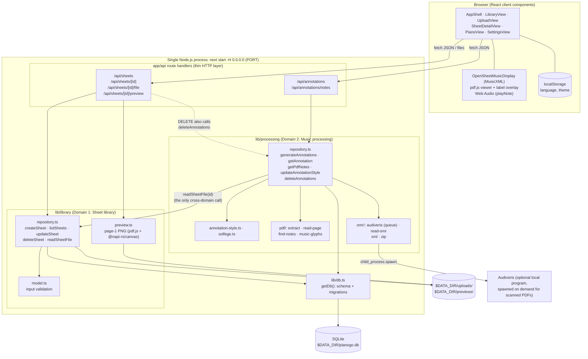

```mermaid
flowchart TB
  subgraph Browser["Browser (React client components)"]
    UI["AppShell · LibraryView · UploadView<br/>SheetDetailView · PianoView · SettingsView"]
    Render["OpenSheetMusicDisplay (MusicXML)<br/>pdf.js viewer + label overlay<br/>Web Audio (playNote)"]
    LS[("localStorage<br/>language, theme")]
    UI --- Render
    UI --- LS
  end

  subgraph Proc["Single Node.js process: next start -H 0.0.0.0 (PORT)"]
    subgraph Routes["app/api route handlers (thin HTTP layer)"]
      RS["/api/sheets<br/>/api/sheets/[id]<br/>/api/sheets/[id]/file<br/>/api/sheets/[id]/preview"]
      RA["/api/annotations<br/>/api/annotations/notes"]
    end

    subgraph Lib["lib/library (Domain 1: Sheet library)"]
      LM["model.ts<br/>input validation"]
      LR["repository.ts<br/>createSheet · listSheets · updateSheet<br/>deleteSheet · readSheetFile"]
      LP["preview.ts<br/>page-1 PNG (pdf.js + @napi-rs/canvas)"]
    end

    subgraph Pro["lib/processing (Domain 2: Music processing)"]
      PR["repository.ts<br/>generateAnnotations · getAnnotation<br/>getPdfNotes · updateAnnotationStyle<br/>deleteAnnotations"]
      PS["annotation-style.ts · solfege.ts"]
      PDF["pdf/: extract · read-page<br/>find-notes · music-glyphs"]
      OMR["omr/: audiveris (queue) · read-omr<br/>xml · zip"]
    end

    DB["lib/db.ts<br/>getDb(): schema + migrations"]
  end

  SQL[("SQLite<br/>$DATA_DIR/pianogo.db")]
  FS[("$DATA_DIR/uploads/<br/>$DATA_DIR/previews/")]
  AUD["Audiveris (optional local program,<br/>spawned on demand for scanned PDFs)"]

  UI -- "fetch JSON / files" --> RS
  UI -- "fetch JSON" --> RA
  RS --> LR
  RS --> LP
  RS -. "DELETE also calls<br/>deleteAnnotations" .-> PR
  RA --> PR
  LR --> LM
  PR --> PS
  PR --> PDF
  PR --> OMR
  PR -- "readSheetFile(id)<br/>(the only cross-domain call)" --> LR
  LR --> DB
  PR --> DB
  DB --> SQL
  LR --> FS
  LP --> FS
  OMR -- "child_process.spawn" --> AUD
```