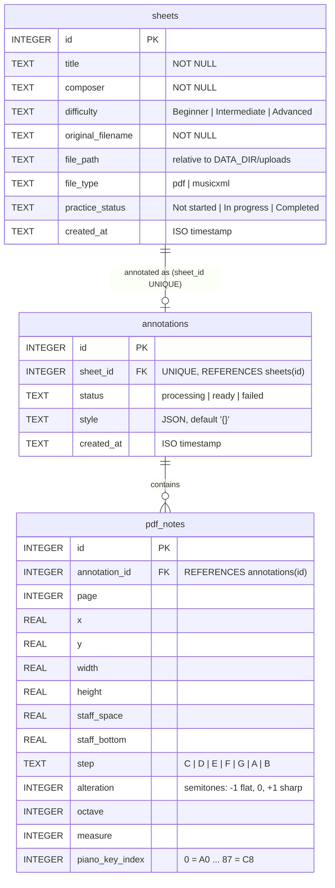

```mermaid
erDiagram
  sheets ||--o| annotations : "annotated as (sheet_id UNIQUE)"
  annotations ||--o{ pdf_notes : "contains"

  sheets {
    INTEGER id PK
    TEXT title "NOT NULL"
    TEXT composer "NOT NULL"
    TEXT difficulty "Beginner | Intermediate | Advanced"
    TEXT original_filename "NOT NULL"
    TEXT file_path "relative to DATA_DIR/uploads"
    TEXT file_type "pdf | musicxml"
    TEXT practice_status "Not started | In progress | Completed"
    TEXT created_at "ISO timestamp"
  }

  annotations {
    INTEGER id PK
    INTEGER sheet_id FK "UNIQUE, REFERENCES sheets(id)"
    TEXT status "processing | ready | failed"
    TEXT style "JSON, default '{}'"
    TEXT created_at "ISO timestamp"
  }

  pdf_notes {
    INTEGER id PK
    INTEGER annotation_id FK "REFERENCES annotations(id)"
    INTEGER page
    REAL x
    REAL y
    REAL width
    REAL height
    REAL staff_space
    REAL staff_bottom
    TEXT step "C | D | E | F | G | A | B"
    INTEGER alteration "semitones: -1 flat, 0, +1 sharp"
    INTEGER octave
    INTEGER measure
    INTEGER piano_key_index "0 = A0 ... 87 = C8"
  }
```